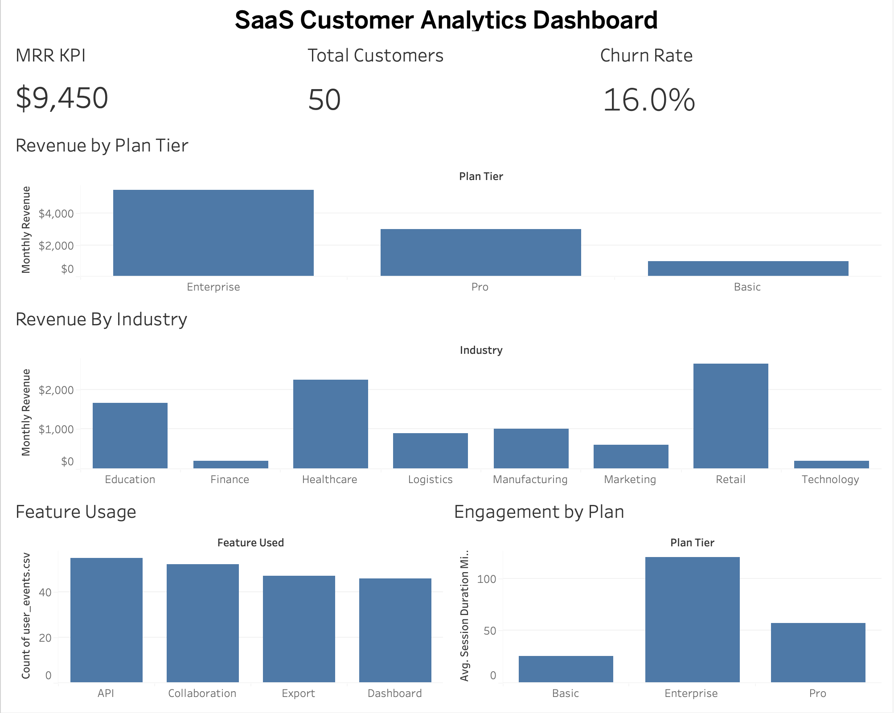

# SaaS Customer Analytics Dashboard

## Project Overview

This project demonstrates an end-to-end Business Intelligence workflow using Tableau. The dashboard analyzes customer subscriptions, recurring revenue, churn, engagement, and feature adoption for a simulated B2B SaaS company.

## Business Objective

The goal of this project is to provide stakeholders with key business insights into customer behavior, subscription performance, and product engagement.

Key business questions:

* What is the current Monthly Recurring Revenue (MRR)?
* What percentage of customers have churned?
* Which subscription tiers generate the most revenue?
* Which industries contribute the most revenue?
* Which product features are used most frequently?
* How does customer engagement vary by subscription plan?

## Dataset

The project uses three relational datasets:

### users.csv

* user_id
* company_name
* signup_date
* industry

### subscriptions.csv

* sub_id
* user_id
* plan_tier
* monthly_revenue
* status

### user_events.csv

* event_id
* user_id
* event_date
* session_duration_minutes
* feature_used

## Data Modeling

A star schema relationship model was created in Tableau:

users.user_id → subscriptions.user_id

users.user_id → user_events.user_id

This allows cross-table analysis across customers, subscriptions, and engagement activity.

## Dashboard Metrics

* Monthly Recurring Revenue (MRR)
* Total Customers
* Customer Churn Rate

## Dashboard Visualizations

* Revenue by Plan Tier
* Revenue by Industry
* Feature Usage Analysis
* Customer Engagement by Subscription Plan

## Tools Used

* Tableau
* Data Modeling
* Business Intelligence Reporting
* Data Visualization
* CSV Data Sources

## Dashboard Preview

## Key Insights

* Enterprise subscriptions generated the largest share of revenue.
* Retail and Healthcare contributed the highest revenue among industries.
* Enterprise customers demonstrated the highest average engagement.
* Customer churn rate was approximately 16%.

## Author

Gina Cheng

Case Western Reserve University

B.S. Computer Science, Minor in Psychology
